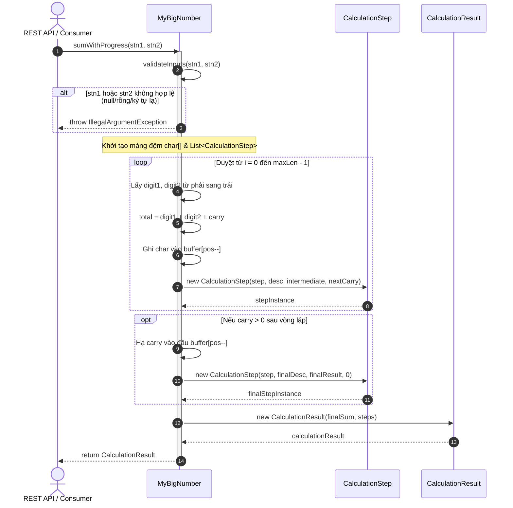
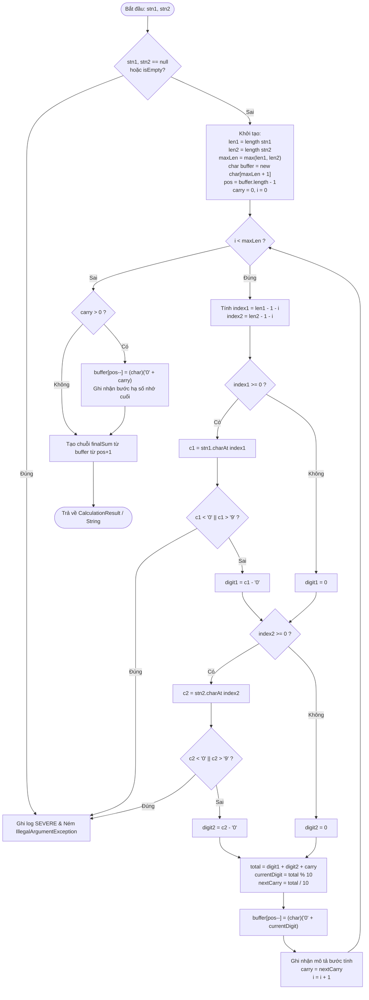

# `algorithm.md` — Technical Flow & Logic (`my-big-number-core`)

## 1. Nguyên lý Toán học & Bản chất Giải thuật

Giải thuật trong `MyBigNumber.java` mô phỏng chính xác thuật toán **cộng đặt tính cột dọc** mà học sinh tiểu học thực hiện trên giấy:

```text
    1 2 3 4   (Số thứ nhất stn1)
  +   8 9 7   (Số thứ hai stn2)
  ---------
    2 1 3 1   (Tổng kết quả)
```

### Các nguyên tắc cốt lõi:
1. **Duyệt từ phải sang trái (Least Significant Digit -> Most Significant Digit):** Bắt đầu từ hàng đơn vị ($i = 0$), hàng chục ($i = 1$), hàng trăm ($i = 2$)...
2. **Căn chỉnh độ dài động (Implicit Zero Padding):** Nếu một chuỗi có độ dài ngắn hơn chuỗi kia, các vị trí không tồn tại được quy ước có giá trị là $0$.
3. **Công thức số học tại mỗi bước $i$:**
   $$\text{digit}_1 = \text{char}(len_1 - 1 - i) - '0' \quad (\text{hoặc } 0 \text{ nếu } index_1 < 0)$$
   $$\text{digit}_2 = \text{char}(len_2 - 1 - i) - '0' \quad (\text{hoặc } 0 \text{ nếu } index_2 < 0)$$
   $$\text{total} = \text{digit}_1 + \text{digit}_2 + \text{carry}_{\text{old}}$$
   $$\text{currentDigit} = \text{total} \pmod{10}$$
   $$\text{carry}_{\text{new}} = \lfloor \text{total} / 10 \rfloor$$
4. **Hạ số nhớ cuối cùng (Final Overflow Carry):** Khi đã duyệt hết tất cả chữ số ($i = \max(len_1, len_2)$), nếu $\text{carry} > 0$, một chữ số mới được chèn thêm vào đầu kết quả.

---

## 2. So sánh Kiến trúc Hai Luồng Thực thi

Mã nguồn chia tách thành 2 phương thức riêng biệt để cân bằng giữa **hiệu năng tối đa** và **khả năng diễn giải chi tiết**:

| Tiêu chí so sánh | Luồng 1: Fast Path (`sum`) | Luồng 2: Full Progress Path (`sumWithProgress`) |
| :--- | :--- | :--- |
| **Vị trí code** | `MyBigNumber.java:sum` | `MyBigNumber.java:sumWithProgress` |
| **Mục đích** | Backend tính toán siêu tốc, không cần UI | Hiển thị bảng mô phỏng, animation giải thích |
| **Đối tượng sinh ra** | Chỉ 1 mảng `char[]` duy nhất | $N$ đối tượng `CalculationStep`, 1 `CalculationResult` |
| **Logging** | Hoàn toàn im lặng (Zero Logger Calls) | Log `INFO` chi tiết từng bước (nếu bật log) |
| **Độ phức tạp thời gian** | $\mathcal{O}(N)$ với hằng số $C$ cực nhỏ | $\mathcal{O}(N)$ với phụ phí ghép chuỗi mô tả |
| **Bộ nhớ phụ (Aux Space)** | $\mathcal{O}(1)$ ngoài mảng kết quả trả về | $\mathcal{O}(N)$ để lưu danh sách các bước |

---

## 3. Sơ đồ Luồng Thực thi (Mermaid Diagrams)

### 3.1. Sơ đồ Tuần tự Tương tác (Sequence Diagram)
Mô tả cách một thành phần bên ngoài (ví dụ: REST Controller từ Application Layer) gọi vào `MyBigNumber`:



---

### 3.2. Sơ đồ Luồng Thuật toán Chi tiết (Flowchart)



---

## 4. Mã giả Chi tiết (Step-by-Step Pseudo-Code)

### 4.1. Fast Path Algorithm (`sum`)
```text
FUNCTION sum(stn1: String, stn2: String) -> String:
    ASSERT stn1 is NOT null AND stn1 is NOT empty
    ASSERT stn2 is NOT null AND stn2 is NOT empty
    
    maxLen = MAX(LENGTH(stn1), LENGTH(stn2))
    buffer = ALLOCATE_ARRAY(CHAR, maxLen + 1)
    pos = maxLen       // Con trỏ điền ngược từ cuối mảng về đầu
    carry = 0

    FOR i FROM 0 TO maxLen - 1:
        idx1 = LENGTH(stn1) - 1 - i
        idx2 = LENGTH(stn2) - 1 - i

        digit1 = 0
        IF idx1 >= 0:
            c1 = stn1[idx1]
            IF c1 < '0' OR c1 > '9': THROW IllegalArgumentException
            digit1 = c1 - '0'

        digit2 = 0
        IF idx2 >= 0:
            c2 = stn2[idx2]
            IF c2 < '0' OR c2 > '9': THROW IllegalArgumentException
            digit2 = c2 - '0'

        total = digit1 + digit2 + carry
        buffer[pos] = '0' + (total MOD 10)
        pos = pos - 1
        carry = total DIV 10

    IF carry > 0:
        buffer[pos] = '0' + carry
        pos = pos - 1

    RETURN SUBSTRING(buffer, FROM pos + 1 TO maxLen)
```

---

## 5. Các Kỹ thuật Tối ưu Hóa Hiệu năng Chuyên sâu

### Kỹ thuật 1: Triệt tiêu thảm họa hiệu năng $\mathcal{O}(N^2)$ của `StringBuilder.insert(0, ...)`
* **Vấn đề thông thường:** Khi dùng `sb.insert(0, char)` để nối chữ số vào đầu chuỗi, toàn bộ mảng ký tự nội bộ của `StringBuilder` phải dịch chuyển sang phải 1 vị trí bằng `System.arraycopy`. Với số dài $N$ chữ số, tổng số thao tác copy là $1 + 2 + \dots + N = \frac{N(N+1)}{2} \approx \mathcal{O}(N^2)$. Với số $100.000$ chữ số, việc này cần khoảng **5 tỷ phép copy**, gây nghẽn CPU hoàn toàn.
* **Giải pháp trong Core:** Cấp phát mảng tĩnh `char[] buffer = new char[maxLen + 1]` và duy trì con trỏ `pos = buffer.length - 1`. Chữ số mới được gán trực tiếp vào ô nhớ `buffer[pos--] = ...` đạt độ phức tạp **$\mathcal{O}(1)$ tuyệt đối**.

### Kỹ thuật 2: Tái sử dụng Bộ đệm chuỗi (Buffer Reuse) & Zero-Autoboxing
* Trong `sumWithProgress`, một đối tượng `StringBuilder desc = new StringBuilder(128)` duy nhất được tạo trước vòng lặp và reset bằng lệnh `desc.setLength(0)` ở mỗi bước lặp.
* Không sử dụng `String.format(...)` trong vòng lặp vì `String.format` phải parse cú pháp regex và tự động đóng gói (autoboxing) các biến nguyên thủy `int` thành đối tượng `Integer`, gây áp lực rác khổng lồ lên bộ thu gom rác Java Garbage Collector (GC).

### Kỹ thuật 3: Pre-allocation Capacity cho Collections
* Khởi tạo trước kích thước cho `ArrayList`:
  ```java
  List<CalculationStep> steps = new ArrayList<>(maxLen + 1);
  ```
  Ngăn chặn hoàn toàn việc `ArrayList` phải liên tục re-allocate mảng nội bộ (tăng kích thước $1.5$ lần) và copy dữ liệu cũ khi dung lượng đầy.

---

## 6. Bảng Minh họa Tiến trình Đặt tính Mẫu (`1234 + 897`)

* $len_1 = 4$, $len_2 = 3$ $\rightarrow$ $maxLen = 4$. Kích thước buffer = $5$.

| Bước ($i$) | Hàng xét | `digit1` | `digit2` | `carry` cũ | Tổng `total` | Chữ số lưu | `carry` mới | Kết quả tạm thời | Diễn giải sinh ra |
| :---: | :--- | :---: | :---: | :---: | :---: | :---: | :---: | :---: | :--- |
| **1** ($i=0$) | Đơn vị | 4 | 7 | 0 | 11 | **1** | 1 | `"1"` | Lấy 4 cộng với 7 được 11. Lưu 1 vào kết quả tạm "1". Ghi nhớ 1. |
| **2** ($i=1$) | Chục | 3 | 9 | 1 | 13 | **3** | 1 | `"31"` | Lấy 3 cộng với 9 được 12. Cộng tiếp với nhớ 1 được 13. Lưu 3 vào kết quả tạm "31". Ghi nhớ 1. |
| **3** ($i=2$) | Trăm | 2 | 8 | 1 | 11 | **1** | 1 | `"131"` | Lấy 2 cộng với 8 được 10. Cộng tiếp với nhớ 1 được 11. Lưu 1 vào kết quả tạm "131". Ghi nhớ 1. |
| **4** ($i=3$) | Nghìn | 1 | 0 *(pad)* | 1 | 2 | **2** | 0 | `"2131"` | Lấy 1 cộng với 0 được 1. Cộng tiếp với nhớ 1 được 2. Lưu 2 vào kết quả tạm "2131". Ghi nhớ 0. |

Kết quả trả về: **`2131`** với danh sách đúng **4** bước tính có thứ tự.
